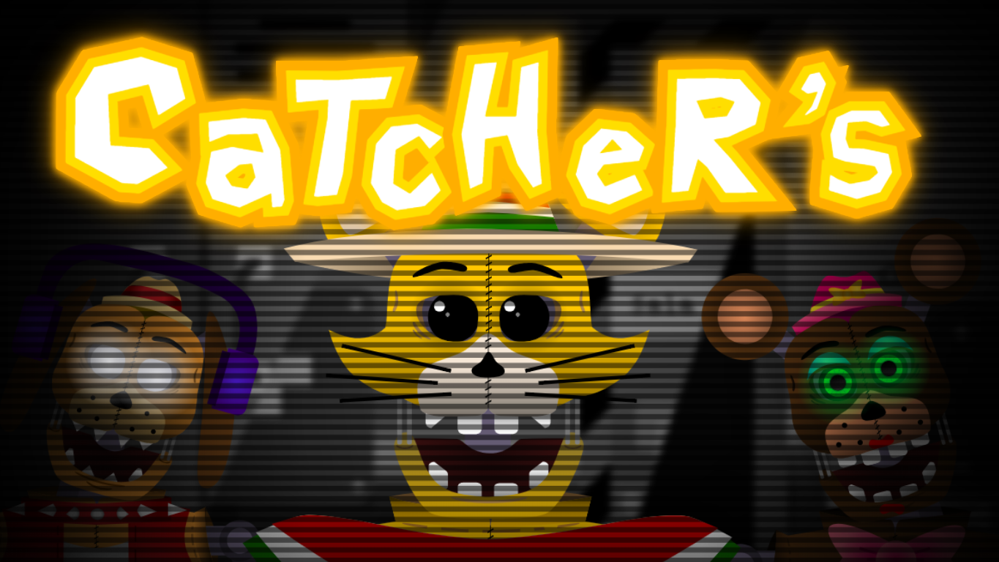

# Repositorio de Catcher's

> Éste repositorio fue creado con la intencionalidad de almacenar cada una de las actualizaciones en el proyecto de "Catcher's para organizar archivos y evitar posibles perdidas del proyecto"

## Índice
1. [Objetos](#objetos)
2. [Cinemáticas](#Cinemáticas)
3. [Utilidades](#Utilidades)
3. [Diséño](#Diséño)
4. [Sonido](#Sonido)
5. [GameJolt](#Gamejolt)

## Cosas Pendientes
- ### Objetos:
    - [X] Pantalla de Carga:
        - [ ] Consejo mientras carga
        - [X] Icono de Carga
        - [X] Animación de la aguja del icono
    - [X] Pantalla de Advertencia:
        - [X] Texto de advertencia
        - [X] Activación/Desactivación de Censuras
        - [X] Redirigir a cinematica 2
        - [X] Scroll Cámara
    - [ ] Menú Principal:
        - [X] Fondo en Movimiento
        - [ ] Imágenes del fondo
        - [X] Titulo Neon y Normal
        - [X] Botones (Comportamiento)
        - [ ] Botones (Redirección)
        - [X] Scroll Cámara
        - [ ] Animatrónicos (Slide)
        - [ ] Animatrónicos (Animación Correspondiente)
- ### Cinemáticas:
    - [ ] Cinemática Introductoria
        - [ ] Animación
        - [ ] Voces Grabadas
        - [ ] Subtitulos
        - [ ] Escritura de dialogos
    - [ ] Cinemática (Arcade Mode)
- ### Utilidades:
    - [X] Transición de escena (aparición y desaparición)
    - [X] Pantalla de Carga
    - [X] Activación/Desactivación de Censuras
    - [ ] Funcionalidad de Censuras
- ### Diséño:
    - [x] Animatrónicos
    - [x] Oficina
        - [x] Paredes
        - [x] Dispositivos
        - [ ] Sonidos
        - [x] Distribución del mapa
        - [x] Movimiento de los Animatrónicos