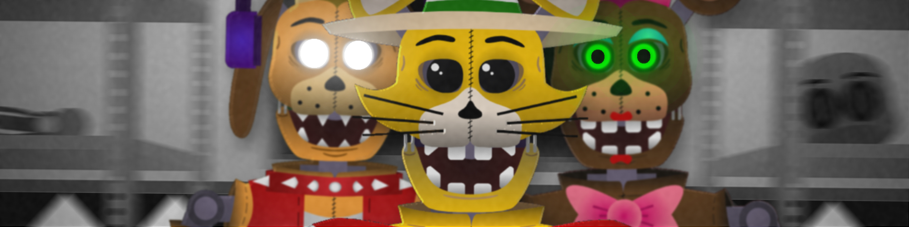

# Repositorio de Catcher's

> Éste repositorio fue creado con la intencionalidad de almacenar cada una de las actualizaciones en el proyecto de "Catcher's" para organizar archivos y evitar posibles perdidas del proyecto. Cualquier sugerencia o modificación es aceptada siempre y cuando sea para aportar al proyecto.

## Índice
1. [Objetos](#objetos)
2. [Cinemáticas](#Cinematicas)
3. [Utilidades](#Utilidades)
3. [Diséño](#Diseño)
4. [Sonido](#Sonido)
5. [GameJolt](#GameJolt)
6. [Motor_Gráfico](#Motor_Gráfico)
7. [Extensiones](#Extensiones)

## Cosas Pendientes
- ### Objetos:
    - [X] Pantalla de Carga:
        - [ ] Consejo mientras carga
        - [X] Icono de Carga
        - [X] Animación de la aguja del icono
    - [X] Pantalla de Advertencia:
        - [X] Texto de advertencia
        - [X] Activación/Desactivación de Censuras
        - [X] Redirigir a cinematica 2
        - [X] Scroll Cámara
    - [ ] Menú Principal:
        - [X] Fondo en Movimiento
        - [ ] Imágenes del fondo
        - [X] Titulo Neon y Normal
        - [X] Botones (Comportamiento)
        - [ ] Botones (Redirección)
        - [X] Scroll Cámara
        - [X] Animatrónicos (Slide)
        - [X] Animatrónicos (Animación Correspondiente)
    - [ ] Menú de Configuración:
        - [X] Pestañas de configuración
        - [X] Botón para volver
        - [X] Movilidad del fondo y de la cámara
        - [X] Imágen del fondo
        - [ ] Configuración funcional
        - [ ] Conexión a Gamejolt
- ### Cinematicas:
    - [ ] Cinemática Introductoria
        - [ ] Animación
        - [ ] Voces Grabadas
        - [ ] Subtitulos
        - [ ] Escritura de dialogos
    - [ ] Cinemática (Arcade Mode)
- ### Utilidades:
    - [X] Transición de escena (aparición y desaparición)
    - [X] Pantalla de Carga
    - [X] Activación/Desactivación de Censuras
    - [ ] Funcionalidad de Censuras
- ### Diseño:
    - [x] Animatrónicos
    - [x] Oficina
        - [x] Paredes
        - [x] Dispositivos
        - [ ] Sonidos
        - [x] Distribución del mapa
        - [x] Movimiento de los Animatrónicos
        - [ ] Efectos
    - [ ] Sala Mantenimiento
        - [ ] Clasificado . . .
- ### GameJolt:
    - GamePage: [Link to The Page](https://gamejolt.com/games/catchers/903293)
    - [ ] Trofeos
    - [ ] Cloud Storage
    - [X] Baner y Thumbnail
- ### Motor Gráfico:
    - Penguinmod (A Turbowarp Mod)
    - Link: https://penguinmod.com
- ### Extensiones:
    - Aquí enlistaré todas la extensiones empleadas en el desarrollo
    - Algunas son de Turbowarp y otras de PenguinMod (En su mayoría)